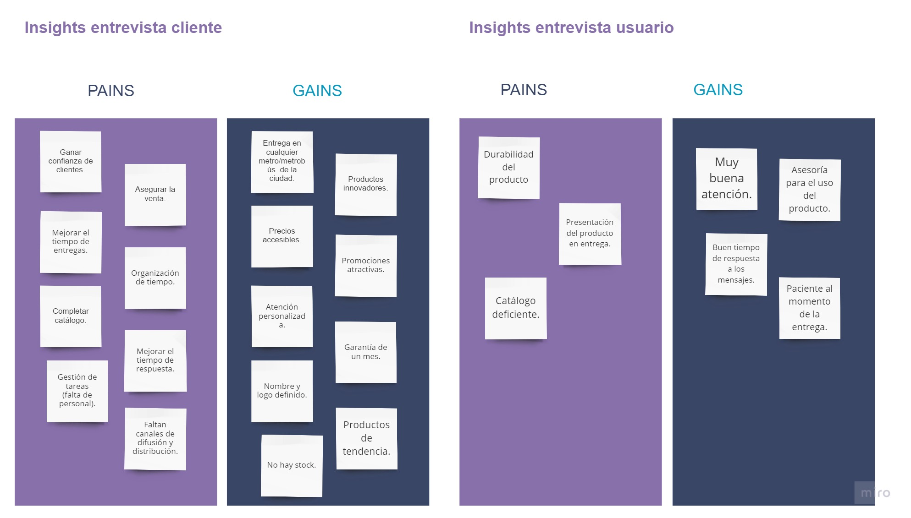
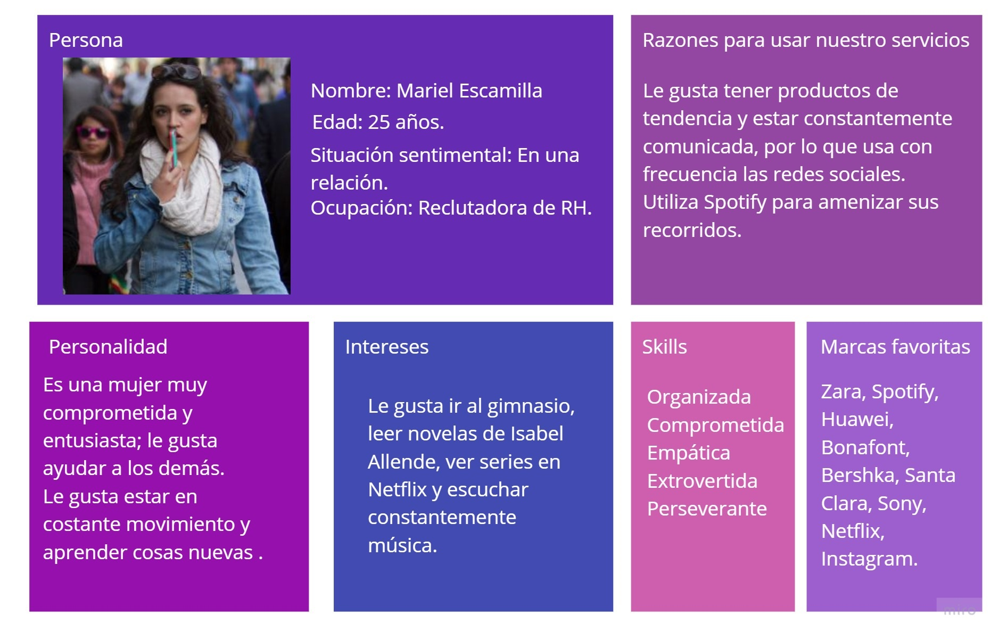
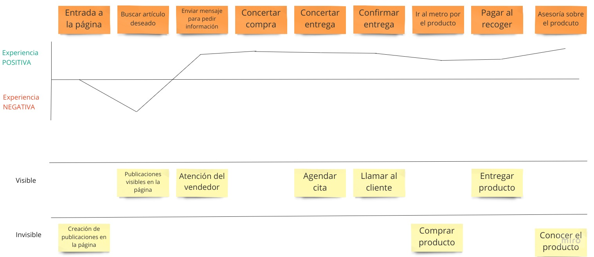
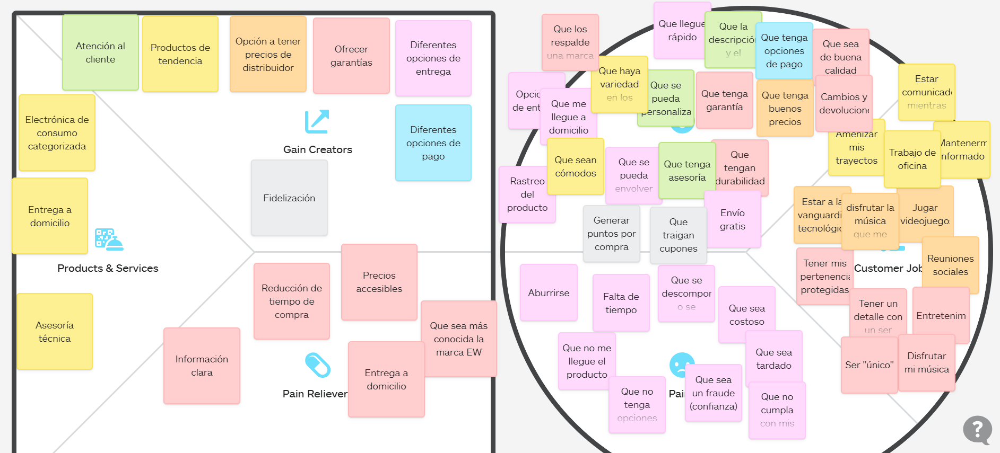
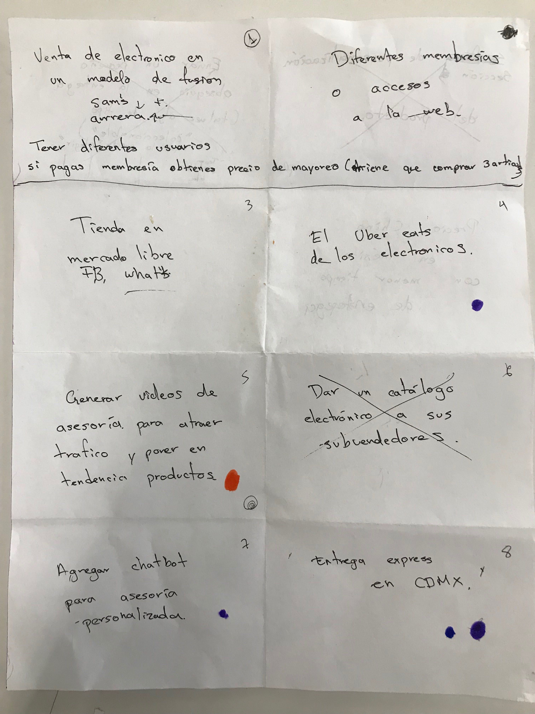
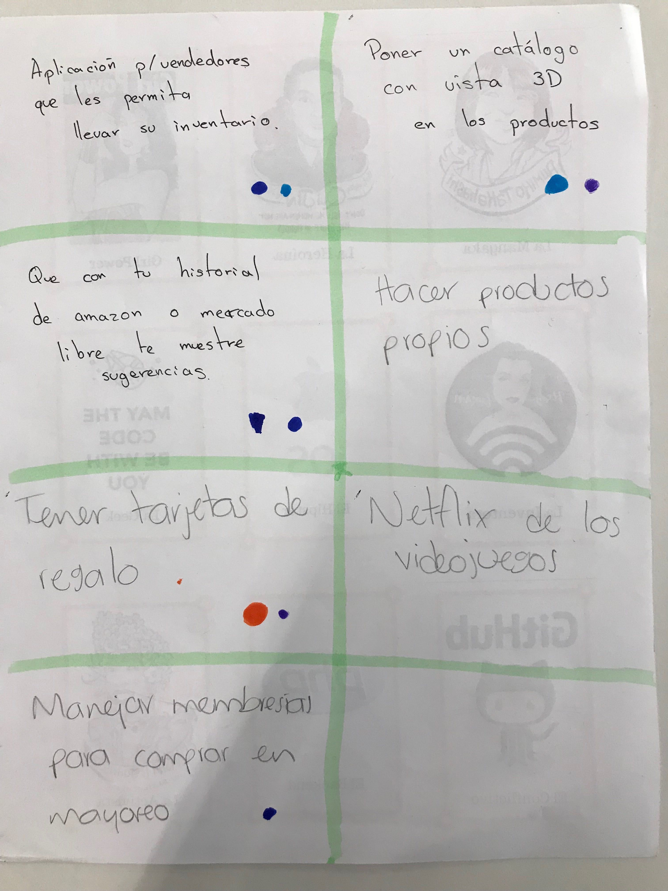
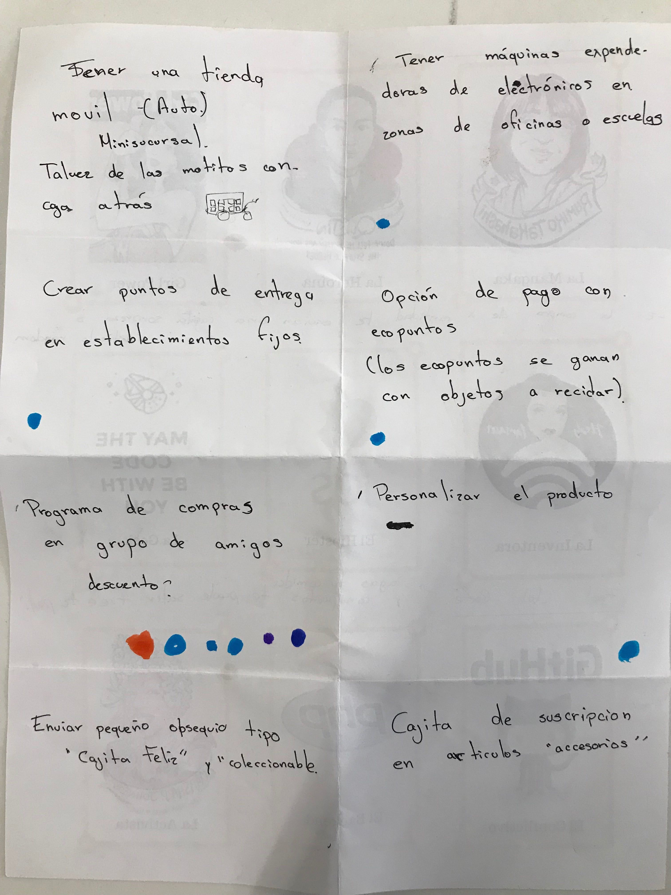
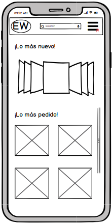
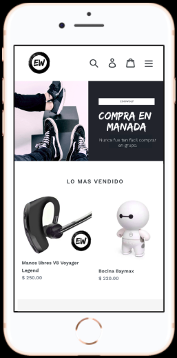

# Einswolf

## Objetivo

Reducir la brecha tecnológica entre las y los propietarios de pequeños emprendimientos, ayudándoles por medio de un estudio inicial para poder visualizar  una mejor forma de ofrecer sus productos y/o servicios a los consumidores. 
Para ello, se realizaron diversos estudios con el fin de averiguar cómo son las y los usuarios que utilizarían este canal de venta, cuáles son sus motivaciones y 
cómo es el mercado actual en el que incursionarán.

## Objetivos de aprendizaje

El objetivo principal de aprendizaje de este proyecto es entender cómo pasamos
de lo que un cliente quiere alcanzar a la definición de un producto digital en
poco tiempo. Entender los principales pasos y preguntas que debemos hacernos,
cómo involucrar a los usuarios y su feedback y cómo usar esos resultados sin
perder de vista los objetivos iniciales.
Entender las necesidades y falencias de
las empresas, aprender y empezar a empaparte de los posibles modelos de negocio
así como investigar a su audiencia, los usuarios que consumen sus productos,
entendiendo sus preferencias y contexto en el que lo hacen.

De la misma manera definir cuál es la mejor forma de ofrecer los
productos del cliente a sus usuarios, y, crear una propuesta de valor y
sus objetivos. También, definir los contenidos, la interacción y el
diseño del proceso a partir del cual el usuario podrá hacer sus pedidos en esta
plataforma.

## Problemas identificados en la investigación

Nuestro cliente es Oscar David Vázquez Flores, y tiene un E-commerce de electrónica de consumo y accesorios llamado EinsWolf.
 Para poder identificar las áreas de oportunidad fue necesario conocer lo mejor posible el negocio,por lo cual se realizaron entrevistas al cliente y a los usuarios; tanto en persona como a través de formularios.

 Para ello se realizaron las siguientes preguntas: [Cliente](https://docs.google.com/document/d/1WT9mUNthPmQJrcSEjC5tYEXoDZpqwKsqs8EfWq40A7c/edit)  y [Usuario](https://drive.google.com/drive/folders/1rW4k5NQozC54B4QjZOYnImiYYp1gzZkF).

 El audio de la entrevista se puede consultar en el siguiente enlace [Entrevista al cliente](https://drive.google.com/drive/folders/1WjuThii2G9BmF3uEceopvbkZPUk8QrVE).

 Una vez que tuvimos un mejor entendimiento del negocio, pudimos organizar nuestro trabajo para poder cumplir con todos los requisitos en tiempo y forma, para lo cual realizamos un [Calendario de trabajo](https://drive.google.com/drive/folders/1JgSYN-34UORJOBNawfinWzgrXQ33PZwL) y un [Presupueto](https://drive.google.com/drive/folders/1JgSYN-34UORJOBNawfinWzgrXQ33PZwL).

 Para obtener el contexto del mercado hicimos una extensa investigación, tanto de la competencia como de los usuarios potenciales; para lo cual nos basamos en gran medida en el [Estudio sobre venta online México 2019](https://drive.google.com/drive/folders/1rW4k5NQozC54B4QjZOYnImiYYp1gzZkF) realizado por la AMVO. Las demás fuentes consultadas pueden revisarlas en [Fuentes de investigación](https://drive.google.com/drive/folders/1rW4k5NQozC54B4QjZOYnImiYYp1gzZkF).

 Con toda la información disponible fuimos capaces de encontrar los pains y gains de nuestro negocio.

 

 ## Definición del público objetivo

 La investigación realizada nos ayudó a delimitar a nuestros potenciales usuarios, sus deseos y frustraciones. Todo esto permitiéndonos empatizar mejor con sus necesidades y la mejor forma de satisfacerlas.

 

 Mystery shopper es una herramienta que nos facilitó reconocer los pains y gains de nuestro usuario. Los recursos se pueden consultar en  [Primer acercamiento](https://docs.google.com/document/d/1sC_sK5DDAXnphVIRO2gkj4vj9rQw5nznQGGO6v2-NxE/edit) y el [Audio](https://drive.google.com/drive/folders/1rW4k5NQozC54B4QjZOYnImiYYp1gzZkF).
 Con esto pudimos realizar el Customer Journey Map.

 

 ## Definición del producto

 Una vez que tuvimos la mayor información posible, realizamos un User Persona Map y un Value Proposition Map, con el fin de priorizar y satisfacer mejor las necesidades de nuestros usuarios. 

 

 Para la etapa de ideación se realizó la técnica de Crazy eights, para generar una lluvia de ideas. Como resultado obtuvimos 23 ideas diferentes para generar una propuesta de valor, las cuales fueron sometidas a votación; con lo cual nos dimos cuenta de la propuesta que generaba más valor para nuestros usuarios.

### Propuesta de Valor

Para generar una experiencia de compra satisfactoria y diferente, creamos el concepto de Compra en manada. El cual consiste en unirte con 3 o más amigos y compartir un carrito de compra dentro de la plataforma de EW, el cual te dará un atractivo descuento y te permitirá dividir el costo de envío. Una vez que se ha formado la manada, se elegirá un líder; quien se encargará de coordinar la compra mediante un código generado por nuestra plataforma y de recibir los productos seleccionados. Para esto es necesario que cada miembro de la manada se registre en la plataforma de EW, el líder recibirá un código que identificará el carrito de compra en común, deberá compartirlo con su manada y a su vez ellos deben ingresarlo en sus carritos para que todos los artículos seleccionados se adjunten al carrito de la manada. Todos los miembros de la manada tendrán un lapso de 48 hrs. para pagar sus artículos seleccionados y de esta forma se genere su descuento y se dividan los gastos de envío.

## Implementación de la solución

Una vez definida nuestra propuesta de valor fue necesario establecer la mecánica para implementarlo, para ello nos fue muy útil realizar un [How To Board](https://drive.google.com/drive/folders/1mFkZYRVVX5qyX8EJXgVNwi-OvycWMJ3o) y [el Flujo de la experiencia](https://drive.google.com/drive/folders/1n_GkdIOQYbTURTuw0xws7-3JZbJNMru2).

## ¿Cómo es que "compra en manada" responden a los objetivos del proyecto?
Los Ecommerce en México han ido ganando terreno contra las tiendas físicas, lo que ha hecho que incluso plataformas como Shopify, Kichink, Mercado libre entre otros den facilidades para este tipo de venta. 
Entre un mar de competencia es importante generar diferenciadores que ayuden a posicionar la marca, ofrecer mejor sus servicios y generar una mejor experiencia de compra para los usuarios.

## ¿Cómo es que "compra en manada" resuelven cada uno de las necesidades del usuario final?
Con esta forma de compra diferente, damos la opción a que el usuario tenga una experiencia compartida de compra con amigos, familiares o conocidos, de una manera simple, rápida y eficiente.
Con este concepto de compra los usuarios reciben productos de tendencia a precios accesibles y con una entrega cómoda a bajo costo.
Este en un proceso que muchas veces ya realizaban de manera informal, por lo que también estamos estandarizando un proceso y les proporcionamos beneficios (descuento, reducción del costo de envío) por elegir nuestra opción.

## Prototipos

En los siguientes enlaces pueden acceder a los diferentes prototipos realizados y que fueron sometidos a una iteración.
 
[Prototipo de mediana fidelidad](https://balsamiq.cloud/s240lbh/pp1vhgy/rA606) realizado en Balsamiq.

[Prototipo de alta fidelidad](https://www.figma.com/proto/eJOWApR1o7Da1tqv74KWp0fN/EW?node-id=6%3A0&scaling=scale-down) realizado en Figma.
 
[Página de EinsWolf en Shopify](https://einswolfs.myshopify.com).

[Carpeta de Drive ](https://drive.google.com/drive/folders/1WjuThii2G9BmF3uEceopvbkZPUk8QrVE?usp=sharing)con todo el contenido generado.

## Colaboradores

Evaluz Vázquez Espinosa https://github.com/eve2921/

Brenda Alejandra Vasquez Orozco  https://github.com/Brendss/

